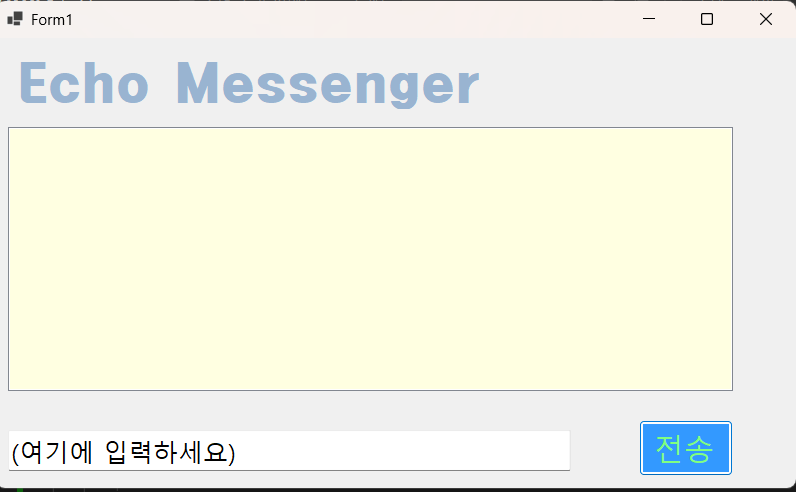

# (c#코딩) Echo Messenger

##개요
-c# 프로그래밍 학습
-1줄소개:
-사용한플랫폼: -C#, .NET Windows Forms, Visual Studio, GitHub
-사용한컨트롤:
-사용한기술과구현한기능:

## 실행화면(과제1)
-과제1코드의실행스크린샷
(img/2026-03-19 124646.png)
-과제 내용
-label,textbox,listbox,button을 사용하여 textbox에 입력후 전송버튼을 누르면 listbox에 들어가게 설정합니다.

-구현내용과 기능 설명
-textbox에 입력하고 버튼을 누르면 listbox에 들어갑니다.
-입력하면 추가로 계속 입력이 가능하게 설정했습니다.
-다시 입력하려면 textbox를 다시 입력해야됩니다.

## 실행화면(과제2)
-과제2코드의실행스크린샷
![과제2 실행화면]
-과제 내용
-엔터를 누르면 textbox에서 listbox로 바로 가게 설정합니다.
-textbox에 입력한 내용이 엔터를 누르면 사라져서 새로 입력하기 쉽게 만들었습니다.
-커서가 엔터를 누른 이후에도 textbox에 유지되게바꿈
-내용이 없으면 입력이 안되게 설정했습니다.

-구현내용과 기능설명
1차과제에선 버튼을 누르면 listbox에 입력되게 설정하였다면 2과제에선 엔터를 누르면 입력되게 설정하였습니다.
그로인해 원래 있던 코드들을 마우스클릭에서 그냥 클릭으로 옮겼습니다.
엔터를 누르면 입력되게 설정했습니다.
